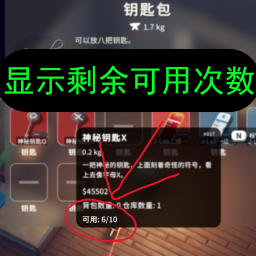
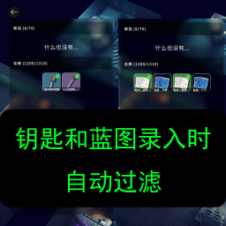
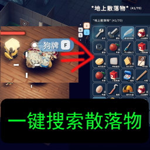
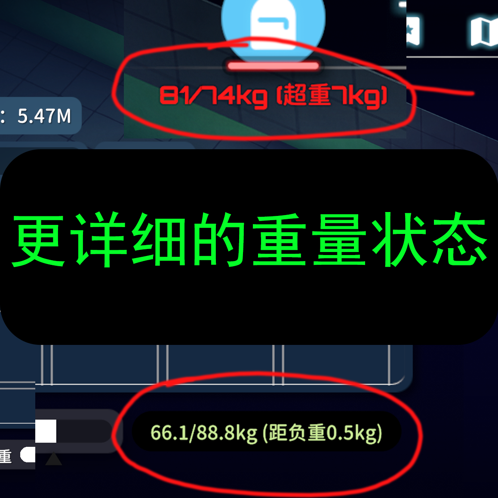

# Duckov Mods Collection

  <a href="./README.md">中文</a> |
  <strong>English</strong>

## Thanks
This mod collection would not be possible without the generous sharing and support from other mod authors in the community. Thank you to all developers who contribute to the modding ecosystem. Their open-source projects, technical sharing, and experience exchange made this collection much easier to build. Special thanks to community members who provided inspiration, solved problems, and offered suggestions during development.

## Introduction
All mods in this repository are independently developed and shared by me. The code has been checked and cleaned up before open-sourcing. These mods aim to improve the game experience by addressing common pain points and helping other players.

## Notes
- Each mod keeps its own README and `info.ini` inside its folder for features and usage.
- Some mods depend on `HarmonyLib`, which should be placed at the top of the mod list.

## Included mods
- Show Item Usages: Shows key uses, gear durability, and usable healing values.
- Auto Filter for Key & Blueprint Registration: Filters irrelevant items in multiple interfaces.
- One-Click Ground Item Search: Search nearby ground items and containers with one key.
- Detailed Weight Status: Shows precise deltas for overweight/heavy/light thresholds.
- Real Dog (Optimized): Optimized lootbox handling and adapted to the one-click ground item search mod.

## Previews
| Mod | Preview | Link |
| --- | --- | --- |
| Show Item Usages |  | [Steam](https://steamcommunity.com/sharedfiles/filedetails/?id=3592946080) |
| Auto Filter for Key & Blueprint Registration |  | [Steam](https://steamcommunity.com/sharedfiles/filedetails/?id=3594850431) |
| One-Click Ground Item Search |  | [Steam](https://steamcommunity.com/sharedfiles/filedetails/?id=3599144451) |
| Detailed Weight Status |  | [Steam](https://steamcommunity.com/sharedfiles/filedetails/?id=3597089297) |
| Real Dog (Optimized) |  | [Steam](https://steamcommunity.com/sharedfiles/filedetails/?id=3605140925) |

## License
Apache-2.0
